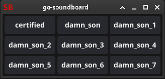

# Go-Soundboard



---
* only supports 48khz mp3 files


### cmd
```shell
go-soundboard -d <Path to Audio files>

  Args
    -c int
        columns (default 3)
    -d string
        dir of 48khz mp3 files (default "audio/")
```
